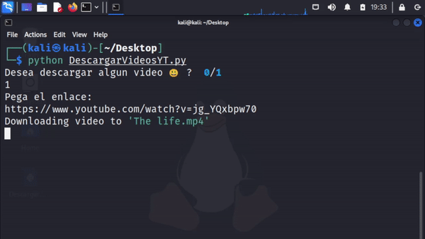

# Bash/ Python Script  para buscar en Youtube

Este software hace uso Pytube y Python con el fin de descargar videos desde la terminal de Windows, Linux o Mac. ✌ ✨


## Instalación

Necesitas haber instalado python 3.9:  https://www.python.org/

```bash
  pip install rich
  pip install pytube 
  pip install tqdm
```
    
## Autor

- [@AgFranc](https://github.com/AgFranc)


## Demo
Prueba en Linux Debian




Prueba en Windows


## Capturas de pantalla


## 🚀 Acerca de mi
Soy un futuro backend developer


## Apendice

Espero que os sea de utilidad

